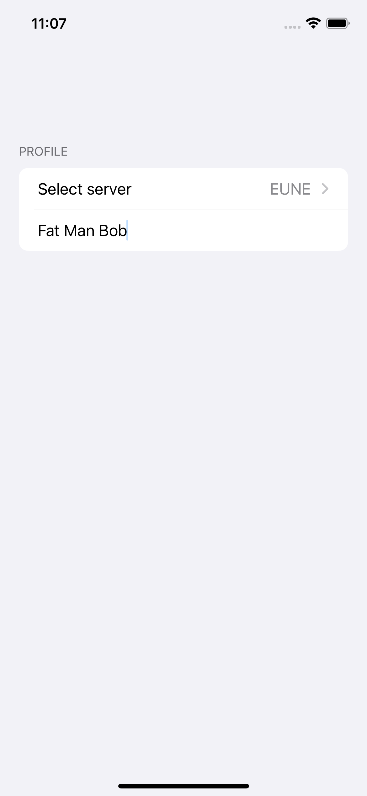
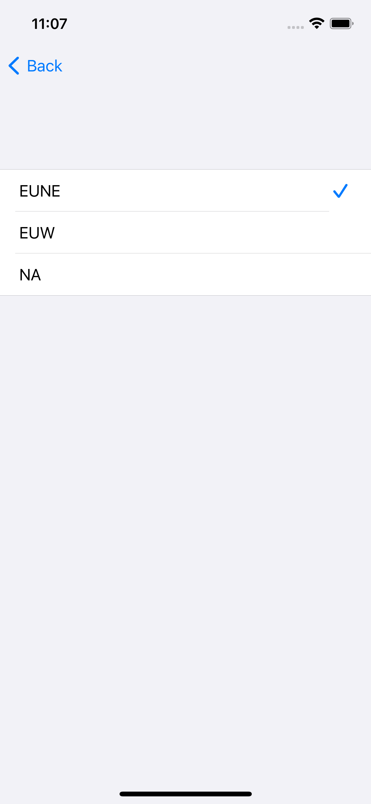
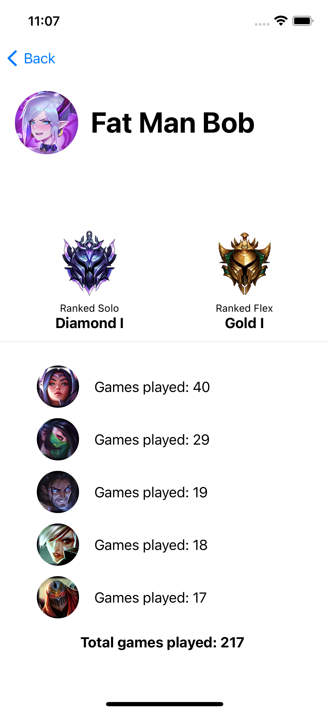
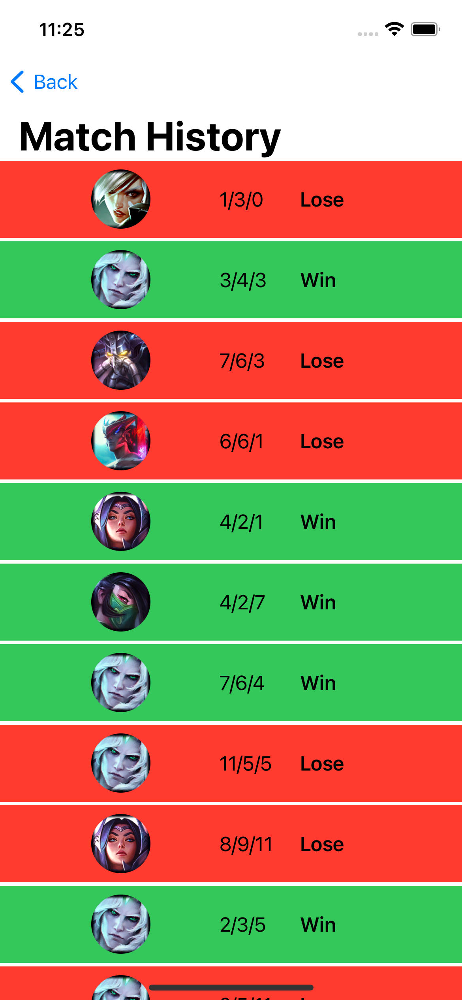

# Programování zařízení Apple
Projekt 2 

Jan Vaculík

Odkaz na [GitHub](https://github.com/vaculikjan/IZA-Projekt-2)

## Zobrazování Summonerů ze hry League of Legends

### Popis:

Aplikace je zaměřená na zobrazení základních informací o hráčích hry League of Legends. Zobrazuje jejich ohodnocení na žebříčku a dále informace o jejich nejhranějších postavách. Aplikace pracuje s oficiální [API](https://developer.riotgames.com/apis) od vývojářů. 

Pro použití je momentálně nutné nastavit ve zdrojovém souboru *SwiftUI_test/ContentView.swift* proměnou `apiKey`. API klíč je totiž platný pouze 24 hodin. 

 

